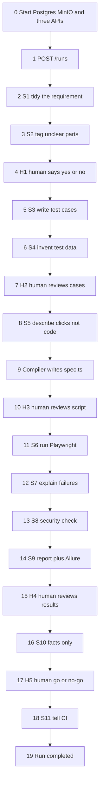

# QAZen end-to-end flow

This document walks **one run** from the first HTTP request to the last CI status, as the code works today.

Running example used on every step:

> “Users must log in with valid credentials and reach the dashboard.”

After each step you should be able to answer: *I sent one request. What happens next?*

Claims below were checked against the repository. If a label says **Mocked**, **Optional**, or **Not currently wired**, that is also from the code.

---

## One-page map

### Services and ports

| What you talk to | Port | Role |
| --- | --- | --- |
| LLM Gateway | `8000` | Asks the language model for JSON, checks the shape, retries |
| Review API + web UI | `8001` | Shows pending work to a human; does **not** change run state itself |
| Orchestrator | `8002` | Sequences the pipeline; the **only** writer of run/gate state |
| Postgres | `5432` | Run rows, saved JSON, reviews, plus LangGraph save-points |
| MinIO | `9000` (console `9001`) | Screenshots / traces / HAR from browser runs |

The three APIs are local Python processes. Postgres and MinIO are Docker Compose (`infra/docker-compose.yml`).

### Storage

- **Postgres tables** (`infra/sql/001_init.sql`): `runs`, `artifacts`, `skill_executions`, `human_reviews`, `test_cases`, `test_executions`, `knowledge_items`
- **LangGraph checkpoints**: same Postgres database, created on first use (`PostgresSaver.setup()`)
- **Disk**: compiled tests under `playwright/generated/<run_id>/`; Allure JSON under `reports/allure-results/<run_id>/`

### Pipeline

`S1 → S2 → [H1] → S3 → S4 → [H2] → S5 (+ compile) → [H3] → S6 → S7 → S8 → S9 → [H4] → S10 → [H5] → S11`



---

## Words used in this document

Defined once, then used in plain English:

- **Skill** — a markdown prompt (`skills/S1/skill.md` … `S11`). It is not a running program. The Gateway reads it fresh every call.
- **Node** — a Python function in the Orchestrator (`node_s1`, `node_s2`, …) that LangGraph calls in order.
- **Gate (H1–H5)** — a pause for a person. The graph stops *before* the next node until someone approves.
- **Artifact** — a JSON blob saved in Postgres `artifacts`. Each skill’s output is stored this way.
- **Checkpoint** — LangGraph’s save-point in Postgres so a paused run can continue after a restart. The save-point id (`thread_id`) is the `run_id`.
- **State** — the in-memory (and checkpointed) bag of fields: `raw_input`, `s1_output`, `s2_output`, …
- **Compiler** — a TypeScript program that turns S5’s JSON “what to click” into a Playwright `.spec.ts` file. Not an LLM.

---

## How an LLM skill actually runs

**Status: Implemented.** Live default is `LLM_PROFILE=ollama` (OpenAI-compatible client → `http://127.0.0.1:11434/v1`). Tests set `LLM_PROVIDER=mock`. Cloud OpenAI is a profile switch. Amazon Bedrock code exists but is not the default.

Used by **S1, S2, S3, S4, S5, S7**. S6 uses this path only when `S6_EXECUTION_MODE=mock`. S8–S11 do **not** call the Gateway in the graph.

```text
Orchestrator node
  → POST http://localhost:8000/v1/skills/{S1|…}/invoke
  → Gateway builds prompt
  → Ollama / OpenAI / mock fixtures
  → parse JSON
  → check schemas/sN.schema.json
  → retry (default 2 extra tries)
  → Orchestrator saves artifact + updates LangGraph state
```

| Piece | Code |
| --- | --- |
| HTTP entry | `llm-gateway/app/main.py` → `invoke()` |
| Prompt | `llm-gateway/app/prompt_builder.py` → `build_prompt()` reads `AGENT_INSTRUCTIONS.md` + `skills/<id>/skill.md` |
| Complete / parse / retry | `llm-gateway/app/gateway.py` → `invoke_skill()` |
| Provider | `llm-gateway/app/providers/__init__.py` → `get_provider()` |
| Orchestrator caller | `orchestrator/app/gateway_client.py` → `invoke_skill()` |
| Save JSON | `orchestrator/app/graph.py` → `_record()` → `db.save_artifact()` + `db.save_skill_execution()` |

If schema retries fail, the Gateway returns `escalated: true`. The Orchestrator then raises `SkillEscalatedError` and does **not** silently invent a default.

The later skill steps below do not repeat this hop. They only say what extra input they send and what JSON they get back.

---

## Step 0 — Start the machines

**Status: Implemented.** Ollama is optional if you use `LLM_PROVIDER=mock` or cloud OpenAI.

### What happens

You start Postgres and MinIO, then the three APIs. Nothing in the pipeline runs yet.

### What is executed

- `docker compose up -d` in `infra/` (Postgres 16, MinIO)
- `uvicorn app.main:app --port 8000` in `llm-gateway/`
- `uvicorn app.main:app --port 8001` in `review-api/`
- `uvicorn app.api:app --port 8002` in `orchestrator/`
- Optional: `.\scripts\start-local-ollama.ps1` or `.\scripts\run-local-e2e.ps1 -SkipE2e`

### How it is triggered

You run those commands (or the one-shot script). No HTTP call starts a run by itself.

### Connected service/component

Docker (Postgres, MinIO) plus three local FastAPI processes. Ollama on `:11434` if `LLM_PROFILE=ollama`.

### Where the code lives

- `infra/docker-compose.yml`
- `scripts/run-local-e2e.ps1`
- `README.md` (manual start)

### Input and output

Input: a working Docker daemon, a Python venv, repo-root `.env`.  
Output: `GET http://127.0.0.1:8000/health`, `:8001/health`, `:8002/health` return `{"status":"ok",...}`.

### How output reaches the next step

Healthy services sit idle until someone posts `/runs`.

### Simple example — Login

You have not mentioned login yet. You only turned the lights on so a login story can be sent in step 1.

---

## Step 1 — Start the run (`POST /runs`)

**Status: Implemented.** Preferred: Review UI **Start a run** at `http://localhost:8001/ui/` (proxies to Orchestrator). Alternates: `POST http://127.0.0.1:8002/runs`, Review API `POST http://127.0.0.1:8001/runs`, or `python -m app.cli start-run`. Jenkins stub can also POST `/runs`. There is no Jira webhook wired as the primary trigger.

### What happens

The Orchestrator creates a new run id, writes a `runs` row with `status='running'` and `current_stage='S1'`, and returns that `run_id` immediately. LangGraph then starts from node `s1` on a worker thread and continues until the first human pause (after S2). CLI `start-run` still waits until that pause so scripts and smoke tests get `{state, next}`.

### What is executed

- `orchestrator/app/api.py` → `create_run()` → `runner.start_run_background()`
- `orchestrator/app/runner.py` → `_persist_run()` then `_invoke_until_pause_safe()` on a thread pool
- CLI / smoke tests still call `start_run()` (persist + wait for H1)
- `db.create_run()` inserts into `runs` with `status='running'`; `_persist_run` sets `current_stage='S1'`
- `PostgresSaver.from_conn_string(...).setup()` then `graph.invoke(initial_state, config={"configurable": {"thread_id": run_id}})` on the worker

### How it is triggered

```http
POST http://127.0.0.1:8002/runs
Content-Type: application/json
```

### Connected service/component

```text
Client (PowerShell, CLI, or Jenkins stub)
  → Orchestrator :8002
  → Postgres (runs row + LangGraph checkpoint)
```

### Where the code lives

```text
orchestrator/app/api.py          create_run()  (HTTP: start_run_background)
orchestrator/app/runner.py       start_run() / start_run_background()
orchestrator/app/db.py           create_run()
orchestrator/app/graph.py        compile_graph() / node_s1()
```

### Input and output

Input (body field `input` becomes `raw_input` on state):

```json
{
  "input": {
    "raw": "Users must log in with valid credentials and reach the dashboard."
  }
}
```

HTTP output (shape from `start_run_background`): `{ "run_id": "<uuid>", "status": "running" }` as soon as the `runs` row exists. Poll Review API `GET /runs/{id}` until `current_stage` is `H1_pending`.

CLI / `runner.start_run()` output: `{ "run_id": "<uuid>", "state": { ... }, "next": ["s3"] }` after S1+S2 finish and H1 pauses. `next: ["s3"]` means “paused before S3”.

### How output reaches the next step

HTTP `POST /runs` returns after the row is inserted. S1 runs on a worker thread inside `graph.invoke`. CLI `start-run` still invokes the graph on the calling thread.

### Simple example — Login

You paste the login sentence. QAZen assigns a `run_id` like `e5707d37-…` and the New Run page navigates to that run while S1–S2 are still running. That id is the name of this pipeline run everywhere: Postgres, checkpoints, generated files.

---

## Step 2 — S1 tidy the requirement

**Status: Implemented** (LLM via Gateway).

### What happens

S1 does **not** improve the requirement. It only puts it into a fixed JSON shape so later steps share the same fields.

### What is executed

- `graph.node_s1()`
- `gateway_client.invoke_skill("S1", state["raw_input"])`
- Gateway `POST /v1/skills/S1/invoke`
- Prompt: `AGENT_INSTRUCTIONS.md` + `skills/S1/skill.md`
- Check: `schemas/s1.schema.json`
- `_record(..., "s1_normalized_requirement", ...)`
- `db.update_run(..., current_stage="S1", status="running")`

### How it is triggered

LangGraph edge `START → s1` after `start_run`.

### Connected service/component

```text
Orchestrator :8002
  → LLM Gateway :8000
  → Ollama / OpenAI / mock
  → Postgres artifacts + skill_executions
```

### Where the code lives

```text
orchestrator/app/graph.py            node_s1()
orchestrator/app/gateway_client.py   invoke_skill()
skills/S1/skill.md
schemas/s1.schema.json
```

### Input and output

Input: the `input` object from step 1 (`{"raw": "..."}`).

Output (required fields from `schemas/s1.schema.json`):

```json
{
  "source_type": "other",
  "title_summary": "Login with valid credentials",
  "description": "Users must log in with valid credentials and reach the dashboard.",
  "acceptance_criteria": [
    "Given valid username and password, when the user submits login, then they reach the dashboard."
  ],
  "business_rules_referenced": [
    "Password length and lockout after failed attempts are not specified."
  ],
  "unstructured_fragments": [],
  "original_source_reference": "POST /runs input.raw"
}
```

(Live Ollama output will vary; mock fixture is `llm-gateway/app/providers/fixtures/s1.json`.)

### How output reaches the next step

Returned as `s1_output` on LangGraph state (checkpointed). Also stored as artifact type `s1_normalized_requirement`. S2 reads `state["s1_output"]`.

### Simple example — Login

The sentence is copied into `title_summary` / `description`. “Valid credentials” is listed under `business_rules_referenced` because the story never said what “valid” means.

---

## Step 3 — S2 tag unclear parts

**Status: Implemented** (LLM via Gateway).

### What happens

S2 labels each claim FACT / ASSUMPTION / INFERENCE / DECISION and lists ambiguities. Then it **opens gate H1** and pauses the graph.

### What is executed

- `graph.node_s2()`
- `invoke_skill("S2", {"s1_output": state["s1_output"]})`
- Artifact type `s2_ambiguity_analysis`
- `db.create_pending_review(run_id, "H1", artifact_id)`
- `db.update_run(..., current_stage="H1_pending", status="paused")`
- LangGraph `interrupt_before=["s3", ...]` so `s3` does not run yet

### How it is triggered

LangGraph edge `s1 → s2` (still inside the original `graph.invoke`).

### Connected service/component

Same Gateway hop as S1, then Postgres `human_reviews` with `decision='pending'`.

### Where the code lives

```text
orchestrator/app/graph.py     node_s2(), compile_graph() interrupt_before
skills/S2/skill.md
schemas/s2.schema.json
orchestrator/app/db.py        create_pending_review()
```

### Input and output

Input: `{ "s1_output": { ... S1 JSON ... } }`.

Output (schema): `tagged_statements`, `ambiguity_list`, `confirmed_carryforward`.

```json
{
  "tagged_statements": [
    {
      "statement": "Users must log in with a valid username and password.",
      "tag": "FACT",
      "layer": "UI"
    }
  ],
  "ambiguity_list": [
    {
      "description": "Password rules and lockout policy are not defined.",
      "kind": "undefined_business_rule"
    }
  ],
  "confirmed_carryforward": []
}
```

### How output reaches the next step

`s2_output` on state + artifact `s2_ambiguity_analysis`. The pending `human_reviews` row is what the Review UI loads. Graph `next` is `s3` but it will not run until H1 is approved.

### Simple example — Login

A reviewer will see: we know login should reach a dashboard, but “valid credentials” is incomplete. They decide whether that is clear enough to design tests.

---

## Step 4 — H1 human says yes or no

**Status: Implemented.**

### What happens

A person looks at S1 + S2.

- **Approve** continues to S3.
- **Request changes** records `changes_requested`, jumps the graph back to S1, re-runs S1+S2 (with `review_feedback` in the skill input), and opens a **new** pending H1 with a bumped artifact version. The run stays alive.
- **Reject** marks the run `failed` (`H1_rejected`) and does **not** resume.

### What is executed

- UI: `review-api/static/` at `GET /ui/` (also **Start a run**)
- `GET /runs/{run_id}/review` loads evidence types `s1_normalized_requirement`, `s2_ambiguity_analysis` (`review-api/app/db.py` `GATE_CONTEXT_ARTIFACT_TYPES`)
- Approve: `POST /runs/{id}/approve` → Orchestrator `POST /runs/{id}/resume` → `runner.approve_gate_and_resume_background()` → `db.decide_review(..., "approved")` then return `{run_id, status: running}`; `resume_run()` (`graph.invoke`) continues on a worker. Poll Review API until the next pending gate.
- Request changes: `POST /runs/{id}/request-changes` → Orchestrator `POST /runs/{id}/request-changes` → `runner.request_changes_and_revise_background()` → decision + `{gate}_revising` recorded immediately; graph re-invoke is background. Poll until a new pending row at the same gate.
- Reject: `POST /runs/{id}/reject` → Orchestrator `POST /runs/{id}/reject` → `runner.reject_gate()` → `runs.status='failed'`, `current_stage='H1_rejected'`

Review API **reads** Postgres. It never writes `runs` / `human_reviews` itself.

### How it is triggered

A person in the browser or a REST client. Not automatic.

### Connected service/component

```text
Reviewer
  → Review API :8001  (read Postgres evidence)
  → Orchestrator :8002 /resume, /request-changes, or /reject
  → Postgres human_reviews + LangGraph (approve / revise)
```

### Where the code lives

```text
review-api/app/main.py           get_review(), approve(), reject(), request_changes(), start_run()
review-api/app/db.py             GATE_CONTEXT_ARTIFACT_TYPES["H1"]
orchestrator/app/api.py          resume(), reject(), request_changes()
orchestrator/app/runner.py       approve_gate_and_resume(), reject_gate(), request_changes_and_revise()
```

### Input and output

Approve body: `{ "reviewer": "qa-lead", "comment": "Clear enough to write cases." }`

Request-changes body: `{ "reviewer": "qa-lead", "comment": "Define password length and lockout." }`  
Output still has `next: ["s3"]` (paused at H1 again) with higher `artifact_version` on the new pending review.

### How output reaches the next step

Approve resume continues from checkpoint; next node is `s3`.  
Request changes re-enters at `s1` until H1 pauses again.

### Simple example — Login

The lead says: “We will treat valid as Sauce Demo `standard_user` / `secret_sauce` for this pilot.” That comment is stored on `human_reviews`. If instead they request changes (“spell out password rules”), S1/S2 run again with that note in `review_feedback`, then H1 appears once more.

---

## Step 5 — S3 write test cases

**Status: Implemented** (LLM via Gateway). Also inserts denormalized rows into `test_cases`.

### What happens

S3 turns the approved requirement into a list of test case specs (ids, layer UI/API, expected result).

### What is executed

- `graph.node_s3()`
- `invoke_skill("S3", {"s1_output": ..., "s2_output": ...})`
- Artifact `s3_test_cases`
- `INSERT INTO test_cases (...)` for each case
- `current_stage="S3"`

### How it is triggered

H1 approve → `resume_run` → LangGraph runs `s3` (`interrupt_before` was on `s3`, now cleared by resume).

### Connected service/component

Orchestrator → Gateway → LLM; Orchestrator → Postgres `artifacts` + `test_cases`.

### Where the code lives

```text
orchestrator/app/graph.py     node_s3()
skills/S3/skill.md
schemas/s3.schema.json
infra/sql/001_init.sql        table test_cases
```

### Input and output

Input: S1 JSON + S2 JSON.

Output (abbreviated; mock fixture `fixtures/s3.json`):

```json
{
  "test_cases": [
    {
      "test_case_id": "TC-001",
      "source_requirement_id": "REQ-LOGIN-001",
      "obligation": "The system must let a user with valid credentials log in and reach the dashboard.",
      "test_type": { "analysis": "EP", "partition_or_boundary": "valid credentials" },
      "layer": "UI",
      "input_values": { "username": "standard_user", "password": "secret_sauce" },
      "expected_result": "The Dashboard heading is visible after login.",
      "expected_result_basis": "acceptance criterion 1",
      "source_tags": ["FACT"],
      "duplicate_check": "new"
    }
  ]
}
```

### How output reaches the next step

`s3_output` on state. S4 is called with `{ "s3_output": state["s3_output"] }`.

### Simple example — Login

You now have `TC-001`: type username, type password, expect the product list / dashboard.

---

## Step 6 — S4 invent test data

**Status: Implemented** (LLM via Gateway). Then opens **H2**.

### What happens

S4 attaches datasets (synthetic or masked values) to each test case. It does not run the app.

### What is executed

- `graph.node_s4()`
- `invoke_skill("S4", {"s3_output": ...})`
- Artifact `s4_test_data`
- `create_pending_review(..., "H2", ...)`
- `status="paused"`, `current_stage="H2_pending"`
- Graph waits before `s5`

### How it is triggered

LangGraph edge `s3 → s4` (same resume that started S3).

### Connected service/component

Orchestrator → Gateway → LLM; Postgres artifacts + `human_reviews` for H2.

### Where the code lives

```text
orchestrator/app/graph.py     node_s4()
skills/S4/skill.md
schemas/s4.schema.json
```

### Input and output

```json
{
  "datasets": [
    {
      "dataset_id": "DS-TC-001",
      "test_case_id": "TC-001",
      "data_values": { "username": "standard_user", "password": "secret_sauce" },
      "source": "synthetic"
    }
  ]
}
```

### How output reaches the next step

`s4_output` on state. H2 UI shows artifacts `s3_test_cases` and `s4_test_data`. After H2 approve, S5 receives both.

### Simple example — Login

The username and password that will be typed are now explicit data, not only words in the test case text.

---

## Step 7 — H2 human reviews cases

**Status: Implemented.** Same Review API as H1; different evidence.

### What happens

A person checks that the cases and data match the requirement. **Approve** continues to S5. **Request changes** re-runs S3+S4 and pauses at H2 again. **Reject** fails the run (`H2_rejected`) without resume.

### What is executed

Same functions as step 4, gate name `H2`. Evidence types: `s3_test_cases`, `s4_test_data`.

### How it is triggered

Person: `POST http://localhost:8001/runs/{run_id}/approve`.

### Connected service/component

Reviewer → Review API `:8001` → Orchestrator `/resume` → LangGraph `s5`.

### Where the code lives

```text
review-api/app/db.py             GATE_CONTEXT_ARTIFACT_TYPES["H2"]
review-api/app/main.py           approve() / reject()
orchestrator/app/runner.py       GATE_TO_NEXT_NODE["H2"] = "s5"
```

### Input and output

Same approve JSON as H1. After success, graph runs S5 (and the compiler) then pauses at H3.

### How output reaches the next step

Resume starts node `s5`.

### Simple example — Login

The reviewer confirms `TC-001` really proves “reach the dashboard,” not merely “login button is clickable.”

---

## Step 8 — S5 describe clicks, not code

**Status: Implemented** (LLM via Gateway). S5 must not emit Playwright source; the schema is an **automation model**.

### What happens

S5 says *what* to do: go to `/`, fill username, click login, assert dashboard visible. It does not write `.spec.ts`.

### What is executed

- `graph.node_s5()` first half
- `invoke_skill("S5", {"s3_output": ..., "s4_output": ...})`
- Artifact `s5_automation_model`

The compiler runs in the same node immediately after (step 9).

### How it is triggered

H2 approve → resume → node `s5`.

### Connected service/component

Orchestrator → Gateway → LLM.

### Where the code lives

```text
orchestrator/app/graph.py     node_s5()  (invoke_skill S5)
skills/S5/skill.md
schemas/s5.schema.json
```

### Input and output

Output (mock fixture `fixtures/s5.json`, abbreviated):

```json
{
  "script_id": "SCR-TC-001",
  "test_case_id": "TC-001",
  "layer": "UI",
  "automation_model": {
    "setup": [{ "type": "navigate", "target": "/" }],
    "actions": [
      { "type": "fill", "locator": "#user-name", "value": "{{username}}" },
      { "type": "fill", "locator": "#password", "value": "{{password}}" },
      { "type": "click", "locator": "#login-button" }
    ],
    "assertions": [
      { "type": "visible", "target": ".inventory_list", "expected_value": true, "test_case_id": "TC-001" }
    ]
  },
  "assertions_plain": ["After valid login, the inventory product list must be visible."]
}
```

`{{username}}` is filled later from S4 `data_values`.

### How output reaches the next step

`s5_output` is passed straight into `compile_s5_model()` in the same Python function.

### Simple example — Login

Instead of a free-form script, you get a shopping list of actions a compiler can turn into Playwright without the LLM inventing waits or weaker asserts.

---

## Step 9 — Compiler writes `.spec.ts`

**Status: Implemented** (deterministic; no LLM). Then opens **H3**.

### What happens

A TypeScript compiler writes a Playwright file. Reviewers at H3 see both the model and the generated source.

### What is executed

- `compiler_client.compile_s5_model(s5_output, s4_output, run_id)`
- Shell: `npx tsx automation-compiler/src/cli.ts <s5.json> <data.json> --out-dir playwright/generated/<run_id>`
- `flatten_s4_test_data()` picks `data_values` for that `test_case_id`
- Artifact `s5_compiled_playwright` (path, file name, source text)
- `create_pending_review(..., "H3", ...)` on the **S5 model** artifact id
- Pause before `s6`

### How it is triggered

Automatically at the end of `node_s5`, not a separate HTTP call.

### Connected service/component

```text
Orchestrator
  → Node/tsx automation-compiler
  → disk playwright/generated/<run_id>/<test_case_id>.spec.ts
  → Postgres s5_compiled_playwright
```

### Where the code lives

```text
orchestrator/app/compiler_client.py   compile_s5_model(), flatten_s4_test_data()
automation-compiler/src/cli.ts
automation-compiler/src/compile.ts
```

### Input and output

Input: S5 JSON + S4 datasets.  
Output metadata: `spec_path`, `file_name`, `source` (full file text). Example of generated file (real run on disk):

```ts
test("TC-UR1-LOGIN", async ({ page, request }) => {
  await page.goto("https://www.saucedemo.com");
  await page.locator("id=username").fill("standard_user");
  await page.locator("id=login-button").click();
  await expect(page.locator("id=inventory_item_name")).toBeVisible();
});
```

Default app URL later at S6 is `QAZEN_BASE_URL` or `https://www.saucedemo.com`.

### How output reaches the next step

`compiled_specs` on LangGraph state. H3 UI also loads `s5_automation_model` + `s5_compiled_playwright`. S6 reads `compiled_specs.out_dir`.

### Simple example — Login

The compiler turns “fill username, click login, assert list visible” into a real Playwright test file named after the test case id.

---

## Step 10 — H3 human reviews the script

**Status: Implemented.**

### What happens

A person checks that the model (and generated spec) assert the **right** thing — not a weaker check that would still pass. **Approve** runs the browser. **Request changes** re-runs S5 (+ compile) and pauses at H3 again. **Reject** stops the run.

### What is executed

Same Review API as H1/H2. Evidence: `s5_automation_model`, `s5_compiled_playwright`. `GATE_TO_NEXT_NODE["H3"] = "s6"`.

### How it is triggered

Person approve/reject on `:8001`.

### Connected service/component

Reviewer → Review API → Orchestrator `/resume` → node `s6`.

### Where the code lives

```text
review-api/app/db.py             GATE_CONTEXT_ARTIFACT_TYPES["H3"]
orchestrator/app/graph.py        interrupt_before includes "s6"
```

### Input and output

Approve JSON as before. Reject does not compile again and does not run Playwright.

### How output reaches the next step

Resume starts `node_s6`.

### Simple example — Login

The reviewer asks: does `.inventory_list` (or the dashboard heading) actually prove we reached the dashboard, or could a failed login still show that locator?

---

## Step 11 — S6 run Playwright

**Status: Implemented** for real browsers when `S6_EXECUTION_MODE=playwright` (default in `orchestrator/app/config.py`). **Mocked** when `S6_EXECUTION_MODE=mock` (Gateway fixture). MinIO upload is **optional / best-effort**: failure records `local://...#minio_upload_failed:...` and the run continues.

### What happens

The compiled spec runs against the target app. Pass/fail, retries, and evidence pointers are collected.

### What is executed

If mock: `invoke_skill("S6", {"s5_output": ...})`.  
If playwright: `playwright_runner.run_playwright_suite()`:

- `npx playwright test -c playwright.config.ts` in `playwright/`
- Env: `QAZEN_SPEC_DIR`, `QAZEN_OUTPUT_DIR`, `QAZEN_JSON_REPORT`, `QAZEN_BASE_URL`
- Parse JSON report → `results` / `retry_log`
- `storage.minio_client.upload_directory()` → `s3://qa-runs/<run_id>/<correlation_id>/...`
- Artifact `s6_execution_result`
- `INSERT INTO test_executions`

### How it is triggered

H3 approve → resume → `s6`.

### Connected service/component

```text
Orchestrator
  → Playwright (Chromium) → target app (QAZEN_BASE_URL)
  → disk playwright/test-results/<run_id>/<correlation_id>/
  → MinIO bucket qa-runs (or local fallback)
  → Postgres artifacts + test_executions
```

### Where the code lives

```text
orchestrator/app/graph.py                 node_s6()
orchestrator/app/playwright_runner.py     run_playwright_suite()
storage/minio_client.py                   upload_directory()
playwright/playwright.config.ts
```

### Input and output

Input: `s5_output` + `compiled_specs`.  
Output (schema `schemas/s6.schema.json`): `run_id`, `correlation_id`, `results`, `evidence_manifest`, `environment_metadata`, `retry_log`.

```json
{
  "run_id": "<uuid>",
  "correlation_id": "<uuid>",
  "results": [
    { "test_case_id": "TC-001", "script_id": "SCR-TC-001", "status": "pass", "duration_ms": 4200 }
  ],
  "evidence_manifest": [
    { "test_case_id": "TC-001", "artifact_type": "screenshot", "storage_uri": "s3://qa-runs/.../test.png" }
  ],
  "retry_log": [{ "test_case_id": "TC-001", "attempts": 1 }]
}
```

### How output reaches the next step

`s6_output` on state. S7 reads failures from `s6_output.results`. S8/S9 also read this object.

### Simple example — Login

Playwright opens Sauce Demo, types `standard_user` / `secret_sauce`, clicks login. If the inventory shows, `status` is `pass`. If not, `fail` plus a screenshot URI.

---

## Step 12 — S7 explain failures

**Status: Implemented** (LLM via Gateway). If nothing failed, the Orchestrator **forces** `classifications` to `[]` even if the model returned extras.

### What happens

Only failed tests are sent to S7. It classifies each as `app_bug`, `flaky`, `environment`, `automation_error`, or `unclassified_pending_triage`. `flaky_history` is currently always `[]` (not loaded from past runs).

### What is executed

- `graph.node_s7()` filters `status == "fail"`
- `invoke_skill("S7", { run_id, failures, retry_log, evidence_manifest, environment_metadata, flaky_history: [] })`
- Artifact `s7_classification`

### How it is triggered

LangGraph edge `s6 → s7` (no human gate between them).

### Connected service/component

Orchestrator → Gateway → LLM; Postgres artifact.

### Where the code lives

```text
orchestrator/app/graph.py     node_s7()
skills/S7/skill.md
schemas/s7.schema.json
```

### Input and output

If login passed, input `failures` is `[]` and output is `{ "run_id": "...", "classifications": [] }`.

If login failed:

```json
{
  "run_id": "<uuid>",
  "classifications": [
    {
      "test_case_id": "TC-001",
      "classification": "app_bug",
      "evidence_trail": ["s3://qa-runs/.../test.png"],
      "confidence": "clear",
      "flaky_history_flag": false
    }
  ]
}
```

### How output reaches the next step

`s7_output` on state. S9 uses it for metrics; S10 uses it for outstanding `app_bug` rows.

### Simple example — Login

Pass: S7 is a no-op list. Fail because the dashboard never appeared: S7 may say `app_bug` (wrong app) vs `automation_error` (bad locator).

---

## Step 13 — S8 security / boundary check

**Status: Implemented** (deterministic `policy_engine.scan_boundaries`). No LLM in the graph. Allowed hosts default to `saucedemo.com` and `reqres.in` (`policy_config.json`).

### What happens

S8 scans S5 actions (and related blobs) for blocked hosts, PII field names, destructive actions. It produces `violations` or a `clean_confirmation` string.

### What is executed

- `graph.node_s8()`
- `policy_engine.scan_boundaries(run_id, s5_output, s6_output, compiled_specs)`
- Artifact `s8_boundary_scan`

### How it is triggered

LangGraph `s7 → s8`.

### Connected service/component

Orchestrator in-process. No extra HTTP service.

### Where the code lives

```text
orchestrator/app/graph.py            node_s8()
orchestrator/app/policy_engine.py    scan_boundaries()
orchestrator/app/policy_config.json
schemas/s8.schema.json
```

### Input and output

```json
{
  "run_id": "<uuid>",
  "violations": [],
  "clean_confirmation": "No boundary violations detected for this run."
}
```

A deny-severity violation later makes S11 fail when `fail_on_unresolved_security` is true.

### How output reaches the next step

`s8_output` on state → S9, S10, S11.

### Simple example — Login

Filling `#user-name` on saucedemo.com is allowed. If the model had posted a password to `prod.internal.example`, S8 would record a violation.

---

## Step 14 — S9 report plus Allure

**Status: Implemented** (deterministic). Allure JSON is **optional** via `ALLURE_ENABLED` (default on). HTML via Allure CLI is **optional** (`ALLURE_GENERATE_HTML` / CLI on PATH). Then opens **H4**.

### What happens

S9 counts pass/fail, attaches classifications, writes a human-readable summary, and writes Allure 2 files. Unclassified failures are kept out of pass-rate (see `report_builder.py`).

### What is executed

- `report_builder.build_s9_report(...)`
- `allure_reporter.write_allure_results(...)` → `reports/allure-results/<run_id>/`
- `append_allure_to_summary()`
- Artifacts `s9_report` and `s9_allure_results`
- `create_pending_review(..., "H4", ...)`
- Pause before `s10`

### How it is triggered

LangGraph `s8 → s9`.

### Connected service/component

Orchestrator in-process + local `reports/` disk. No Gateway.

### Where the code lives

```text
orchestrator/app/graph.py              node_s9()
orchestrator/app/report_builder.py     build_s9_report()
orchestrator/app/allure_reporter.py    write_allure_results()
schemas/s9.schema.json
```

### Input and output

Uses S6 + S7 + S8. Output includes `aggregate_metrics`, `trend_data`, `new_vs_known_failures`, `regressions`, `human_readable_summary`.

### How output reaches the next step

`s9_output` on state. H4 UI shows S6–S9 plus Allure meta.

### Simple example — Login

The report might say: 1 test, 1 passed, pass_rate 1.0, no security violations, Allure files at `reports/allure-results/<run_id>/`.

---

## Step 15 — H4 human reviews results

**Status: Implemented.**

### What happens

A person reviews execution, failure classes, security scan, and the S9 report. **Approve** continues to S10. **Request changes** re-runs S6→S9 and pauses at H4 again. **Reject** fails the run.

### What is executed

Review API evidence: `s6_execution_result`, `s7_classification`, `s8_boundary_scan`, `s9_report`, `s9_allure_results`. `GATE_TO_NEXT_NODE["H4"] = "s10"`.

### How it is triggered

Person on `:8001`.

### Connected service/component

Reviewer → Review API → Orchestrator `/resume` → `s10`.

### Where the code lives

```text
review-api/app/db.py             GATE_CONTEXT_ARTIFACT_TYPES["H4"]
orchestrator/app/graph.py        interrupt_before includes "s10"
```

### Input and output

Approve JSON as before.

### How output reaches the next step

Resume starts `node_s10`.

### Simple example — Login

If login passed, H4 is mostly a confirmation. If it failed as `automation_error`, the reviewer may reject rather than treat it as a product bug.

---

## Step 16 — S10 facts only

**Status: Implemented** (deterministic). The code **enforces** no recommendation language: `BANNED_PHRASE_PATTERNS` in `release_summary.py`; `_assert_no_banned_phrases()` raises `ValueError` if prose contains e.g. “recommend”, “should ship”, “go/no-go”. Then opens **H5**.

### What happens

S10 copies counts, bugs, security findings, and a short factual narrative. It does not say whether to release.

### What is executed

- `release_summary.build_s10_summary(...)`
- Artifact `s10_release_summary`
- `create_pending_review(..., "H5", ...)`
- Pause before `s11`

### How it is triggered

H4 approve → resume → `s10`.

### Connected service/component

Orchestrator in-process. No LLM.

### Where the code lives

```text
orchestrator/app/release_summary.py   build_s10_summary(), BANNED_PHRASE_PATTERNS
schemas/s10.schema.json
```

### Input and output

Fields include `pass_fail_summary`, `outstanding_app_bugs`, `security_violations`, `baseline_comparison`, `data_completeness_note`, `evidence_links`, `factual_narrative`.

`outstanding_app_bugs` only includes S7 rows with `classification == "app_bug"` (that string is what `schemas/s7.schema.json` uses).

### How output reaches the next step

`s10_output` on state. H5 UI shows `s10_release_summary` plus S8, S9, S7.

### Simple example — Login

Narrative like: “1 executed, 1 passed, pass_rate 1.0. No outstanding app_bug classifications. No S8 violations.” It will not say “ready to ship.”

---

## Step 17 — H5 human go / no-go

**Status: Implemented.** This is the only release decision. Reaching `s11` means H5 was approved (`node_s11` passes `h5_approved=True`).

### What happens

A person decides to proceed or stop. **Approve** runs S11. **Request changes** re-runs S10 and pauses at H5 again. **Reject** fails the run (`H5_rejected`); CI is not pushed.

### What is executed

Evidence: `s10_release_summary`, `s8_boundary_scan`, `s9_report`, `s7_classification`. `GATE_TO_NEXT_NODE["H5"] = "s11"`.

### How it is triggered

Person on `:8001`.

### Connected service/component

Reviewer → Review API → Orchestrator `/resume` → `s11`.

### Where the code lives

```text
review-api/app/db.py             GATE_CONTEXT_ARTIFACT_TYPES["H5"]
orchestrator/app/graph.py        interrupt_before includes "s11"
orchestrator/app/runner.py       approve_gate_and_resume()
```

### Input and output

Approve: reviewer name + optional comment. That is the go-ahead. S11 still applies numeric thresholds separately (a human “yes” can still produce CI `fail` if pass rate is below config).

### How output reaches the next step

Resume starts `node_s11`.

### Simple example — Login

The release owner reads the facts, types their name, and approves. They are not rubber-stamping an LLM recommendation — S10 was forbidden from making one.

---

## Step 18 — S11 tell CI

**Status: Implemented.** Default **`CI_GATE_MODE=mock`**: evaluate locally, do not HTTP POST. **Optional HTTP**: `CI_GATE_MODE=http` + `CI_GATE_ENDPOINT` (or `ci_gate_config.json`). Production Jenkins credentials / shared lib are **not wired**; `infra/jenkins/` is a stub.

### What happens

S11 applies thresholds (`min_pass_rate` default 0.95, critical tests, unresolved deny-severity S8). Then records or POSTs `status_pushed`: `pass`, `fail`, or `blocked`. Marks the run `completed`.

### What is executed

- `ci_gate.evaluate_and_push(..., h5_approved=True, ...)`
- Artifact `s11_cicd_status`
- `db.update_run(..., current_stage="S11", status="completed")`

### How it is triggered

H5 approve → resume → `s11`. Not triggered by Jenkins on its own unless someone pointed a webhook at this push.

### Connected service/component

```text
Orchestrator
  → (mock) record artifact only
  → (http) POST JSON to CI_GATE_ENDPOINT
  → Postgres artifacts; runs.status=completed
```

### Where the code lives

```text
orchestrator/app/graph.py             node_s11()
orchestrator/app/ci_gate.py           evaluate_and_push()
orchestrator/app/ci_gate_config.json
infra/jenkins/README.md
schemas/s11.schema.json
```

### Input and output

```json
{
  "run_id": "<uuid>",
  "status_pushed": "pass",
  "push_mode": "mock",
  "cicd_endpoint": "mock://local/ci-gate",
  "fail_reasons": [],
  "linked_summary": { "artifact_type": "s10_release_summary" }
}
```

If pass_rate is below 0.95, `status_pushed` is `fail` even after H5.

### How output reaches the next step

LangGraph edge `s11 → END`. There is no next skill.

### Simple example — Login

One passing UI test → pass_rate 1.0 → mock CI status `pass`. The Jenkins job, if used, would read that artifact or webhook payload; it is not required for the Orchestrator to finish.

---

## Step 19 — Run completed

**Status: Implemented.**

### What happens

`runs.status` is `completed` and `current_stage` is `S11` (set in `node_s11`). LangGraph snapshot `next` is empty.

### What is executed

- Already done in S11: `db.update_run(..., status="completed")`
- `GET /runs/{run_id}` → `runner.get_run_snapshot()` → `graph.get_state()`

`GET /runs` on the **Review** API lists recent rows from Postgres (including pending gate). Orchestrator `GET /runs/{id}` returns checkpoint **values** + `next`.

### How it is triggered

S11 finishing. You can also poll `GET http://127.0.0.1:8002/runs/{run_id}` or open the Review UI.

### Connected service/component

Orchestrator + Postgres (app tables + checkpoints). Review API for history: `GET /runs/{id}/history`.

### Where the code lives

```text
orchestrator/app/graph.py     node_s11()
orchestrator/app/api.py       read_run()
orchestrator/app/runner.py    get_run_snapshot()
review-api/app/main.py        get_history(), list_runs()
```

### Input and output

`GET /runs/{run_id}` returns `{ "values": { "s1_output": ..., "s11_output": ..., ... }, "next": [] }`.

### How output reaches the next step

None. A changed requirement is a **new** `POST /runs`, not an in-place update of this run.

### Simple example — Login

You can point to `run_id` and show: normalized story, cases, spec, Playwright result, factual summary, and CI status — plus five human signatures in `human_reviews`.

---

## How everything connects

```text
Client / CLI / Jenkins stub
  → Orchestrator :8002   POST /runs, /resume, /reject
       ├──→ LLM Gateway :8000 → Ollama or OpenAI or mock
       ├──→ automation-compiler (tsx) → playwright/generated/
       ├──→ Playwright → target app
       ├──→ MinIO qa-runs (best-effort)
       ├──→ Postgres (runs, artifacts, reviews, cases, executions)
       ├──→ LangGraph checkpoints (same Postgres)
       └──→ CI webhook (only if CI_GATE_MODE=http)

Reviewer
  → Review API :8001 /ui  (Start a run, approve, request-changes, reject)
       ├──→ Postgres READ (queue + evidence)
       └──→ Orchestrator WRITE (/runs, /resume, /request-changes, /reject)
```

There is **one writer** for run and gate decisions: the Orchestrator. The Review API is a window plus a proxy.

---

## What is not wired yet

Only listed where the repo supports the conclusion:

| Item | Current status | Evidence |
| --- | --- | --- |
| `knowledge_items` writes | Table exists; no app writes | `infra/sql/001_init.sql`; no Python `INSERT INTO knowledge_items` |
| AWS ECS/EKS hosting | Not deployed | `PROGRESS.md` deferred; local uvicorn + compose |
| Playwright MCP | Not used | Mentioned only in `requirement.md`; S6 shells `@playwright/test` |
| Production Jenkins | Stub only | `infra/jenkins/`; S11 default `CI_GATE_MODE=mock` |
| Amazon Bedrock as default LLM | Code present, not default | `llm-gateway/app/providers/bedrock.py`; default profile is ollama |
| Jira / webhook as primary trigger | Not wired | `orchestrator/app/api.py` comment: v1 is CLI or `POST /runs` |
| S7 historical flake store | Not loaded | `node_s7` passes `flaky_history: []` |
| Requirement-change incremental update | Not a separate path | New run from S1 (`requirement.md` intent; not implemented as a delta engine) |
