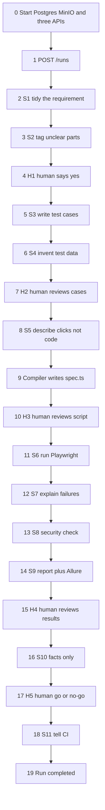

Yes — **this is a good prompt**, especially if your goal is to understand the QAZen system **end-to-end as it is actually implemented**, rather than getting a generic architecture explanation.

I would make a few changes so the resulting document is more useful and less likely to contain assumptions.

### What is already strong

* Clear **start-to-finish sequence**
* Uses one consistent **login → dashboard example**
* Explicitly asks for **code paths**
* Identifies **services and ports**
* Separates **LLM work, human approvals, compilation, execution, reporting, and CI**
* Requests **inputs/outputs at every step**
* Explicitly says **no application-code changes**
* Calls out **"as-built" vs not-yet-wired functionality**
* The Mermaid diagram gives the author a concrete structure to follow

### The main thing I'd improve

Your prompt currently gives a lot of implementation details as facts:

> "Creates a `runs` row and a LangGraph checkpoint..."

> "S4 makes `datasets`..."

> "S7 classifies only failures..."

If some of these are assumptions rather than verified from the repository, the generated document could simply repeat them without checking.

I'd add:

> **Verify every path, function, endpoint, database table, service connection, and execution behavior against the actual repository before documenting it. Do not infer or invent anything. If something differs from this outline, document the actual implementation.**

That's probably the **most important addition**.

---

## I would use this refined version

# E2E Flow Walkthrough

Create `docs/end-to-end-flow.md` — a simple-English, end-to-end walkthrough of **one QAZen run from start to finish**.

Use the same example throughout the document:

> **"Users must log in with valid credentials and reach the dashboard."**

The goal is to understand exactly **what happens at every step, what code runs, which service is involved, where the code lives, what goes in, what comes out, and how the result moves to the next step.**

## Important: Verify Against the Actual Repository

Before documenting each step, verify the implementation from the repository.

Do **not** assume that the paths, functions, endpoints, database tables, service connections, or behaviors in this prompt are correct.

For every step:

* Verify the actual file path
* Verify the actual function/class
* Verify the actual API endpoint
* Verify the actual service involved
* Verify the actual database/table interaction
* Verify the actual input and output
* Verify how the output is passed to the next step
* Verify whether the behavior is real, mocked, optional, or not currently wired

If anything in this prompt differs from the actual implementation, **document the actual implementation instead**.

Do not invent missing behavior.

Clearly mark anything that is:

* Implemented
* Mocked
* Optional
* Not currently wired
* Planned/future

---

## Document Structure

Start with a simple one-page map containing:

1. Services
2. Ports
3. Databases/storage
4. Main request flow
5. A simple pipeline diagram

Then add a short section explaining:

### "How an LLM skill actually runs"

Explain the common LLM flow once so that S1–S5 and S7 do not need to repeat the same details.

Define each technical term the first time it appears, such as:

* Skill
* Node
* Gate
* Artifact
* Checkpoint
* State
* Compiler

Use simple language afterward.

---

# End-to-End Flow

Use this sequence as the intended walkthrough, but verify it against the repository:



---

## For Every Numbered Step

Use exactly these headings:

### What happens

Explain the step in simple English.

### What is executed

Show the actual:

* Function
* Class
* API
* SQL
* Script
* CLI command
* LangGraph node
* Other relevant code

Use the actual repository implementation.

### How it is triggered

Explain exactly what causes this step to run.

For example:

* HTTP request
* Previous LangGraph node
* Human approval
* Database event
* CLI command
* Airflow/job
* CI trigger

### Connected service/component

Explain which service/component is involved.

For example:

```text
Client
  ↓
Orchestrator :8002
  ↓
LLM Gateway :8000
  ↓
Ollama/OpenAI
```

### Where the code lives

Give the exact repository path and function/class name.

Example:

```text
orchestrator/app/graph.py
    node_s1()
```

Do not provide only the directory. Point to the actual implementation wherever possible.

### Input and output

Show a small, realistic example.

For example:

```json
Input:
{
  "raw": "Users must login with valid credentials..."
}
```

Then:

```json
Output:
{
  "title": "User Login",
  "acceptance_criteria": [...]
}
```

### How output reaches the next step

Explain the handoff explicitly.

For example:

```text
S1
 ↓
Postgres artifact
 ↓
LangGraph state
 ↓
S2
```

### Simple example — Login

Explain what happens to:

> "Users must log in with valid credentials and reach the dashboard."

at this particular step.

Keep this explanation very simple.

---

# Step-Specific Details to Verify

## 0. Setup

Verify how local development is actually started.

Expected areas to inspect include:

* Docker/Postgres
* MinIO
* Gateway
* Review API
* Orchestrator
* Ollama, if applicable
* `README.md`
* `scripts/run-local-e2e.ps1`

Document the actual commands and ports.

---

## 1. Start the Run

Verify the actual implementation of:

```text
POST /runs
```

Inspect:

```text
orchestrator/app/api.py
orchestrator/app/runner.py
```

Verify the actual functions, database writes, LangGraph initialization, thread/run IDs, and checkpoint behavior.

Do not assume a LangGraph checkpoint is created unless the code confirms it.

---

## 2. S1 — Normalize Requirement

Verify:

```text
orchestrator/app/graph.py
```

and the actual S1 Gateway request.

Inspect:

```text
AGENT_INSTRUCTIONS.md
skills/S1/skill.md
schemas/s1.schema.json
```

Explain:

```text
Raw requirement
      ↓
S1
      ↓
Normalized requirement
      ↓
Artifact / State / DB
```

Show the login example.

---

## 3. S2 — Ambiguity Analysis

Verify:

* Input from S1
* Gateway call
* Prompt/skill
* Schema
* Artifact
* Database/state changes
* Human gate creation

Explain what happens when:

> "valid credentials"

is unclear because password requirements are not specified.

---

## 4. H1 — Human Review

Verify the actual Review API flow.

Inspect:

```text
review-api/app/main.py
review-api/static/
```

Explain:

```text
Review UI
   ↓
Review API
   ↓
Orchestrator
   ↓
LangGraph resume
```

Explain both:

* Approve
* Reject

based on actual code.

---

## 5–7. S3, S4, H2

Verify how:

* S3 generates test cases
* Test cases are stored
* S4 generates test data
* Datasets are stored
* H2 retrieves and reviews the artifacts

Verify the actual schema/table definitions instead of assuming them.

Use examples such as:

```text
TC-LOGIN-VALID
username = valid user
password = valid password
expected = dashboard
```

---

## 8–10. S5, Compiler, H3

Explain the important distinction between:

```text
S5
Automation model
      ↓
Compiler
      ↓
Playwright TypeScript
```

Verify the actual implementation of:

```text
orchestrator/app/compiler_client.py
automation-compiler/src/cli.ts
```

Show an example of the automation model and the resulting `.spec.ts`.

Explain where the generated file is stored.

---

## 11–14. S6–S9

Verify the actual execution path.

Inspect:

```text
orchestrator/app/playwright_runner.py
orchestrator/app/policy_engine.py
```

and the actual report/evidence handling.

Explain:

```text
Compiled Playwright test
       ↓
Playwright
       ↓
Browser
       ↓
Test evidence
       ↓
MinIO / local storage
       ↓
S7
       ↓
S8
       ↓
S9
       ↓
Allure/report
```

Verify whether MinIO is actually used in the current implementation or whether a local fallback/mock is used.

---

## 15–18. H4, S10, H5, S11

Explain:

```text
H4
 ↓
S10
 ↓
H5
 ↓
S11
 ↓
CI
```

Verify the actual behavior of:

```text
orchestrator/app/ci_gate.py
```

Explain:

* What S10 produces
* What H5 decides
* How S11 applies rules
* Whether Jenkins is actually called or mocked
* What happens for pass/fail

Do not describe S10 as "facts only" unless the implementation actually enforces this.

---

## 19. Completion

Verify exactly how the run reaches its final status.

Explain how:

```text
runs.status
```

is updated and how:

```text
GET /runs/{run_id}
```

returns the final state.

---

# Shared LLM Flow

Create one reusable section explaining the common LLM request path.

Verify the implementation of:

```text
llm-gateway/app/gateway.py
```

Explain:

```text
Skill
 ↓
Prompt construction
 ↓
LLM Gateway
 ↓
Ollama / OpenAI / Mock
 ↓
Response
 ↓
JSON parsing
 ↓
Schema validation
 ↓
Retry if applicable
 ↓
Orchestrator
 ↓
Artifact + LangGraph state
```

For each part, show:

* Code path
* Function
* Input
* Output
* Service connection

---

# Final "How Everything Connects" Diagram

Close the document with a simple diagram showing the actual architecture.

At minimum, cover:

```text
Client
  ↓
Orchestrator
  ├──→ LLM Gateway → LLM provider
  ├──→ Review API
  ├──→ Postgres
  ├──→ Playwright
  ├──→ MinIO
  └──→ CI
```

Adjust this diagram to match the actual implementation.

---

# "What Is Not Wired Yet"

Finish with a short table:

| Component              | Current status | Evidence              |
| ---------------------- | -------------- | --------------------- |
| knowledge_items writes | Verify         | actual code/path      |
| AWS                    | Verify         | actual code/config    |
| Playwright MCP         | Verify         | actual code/config    |
| Jenkins                | Verify         | actual implementation |
| Ollama                 | Verify         | actual configuration  |

Only list something as "not wired" when the repository supports that conclusion.

---

# Writing Style

Use:

* Simple English
* Short paragraphs
* Small code snippets
* Small JSON examples
* Simple diagrams
* Tables where useful

Avoid:

* Unexplained jargon
* Large blocks of code
* Generic architecture theory
* Repeating the same explanation
* Assuming behavior that is not present in the code

The document should be understandable to someone who knows basic software development but has **never seen the QAZen architecture before**.

The reader should be able to answer:

> "I send one request. What happens next?"

at every point in the workflow.

---

# Repository Changes

Create:

```text
docs/end-to-end-flow.md
```

Add one discoverable link to it from:

```text
README.md
```

Do **not** modify:

* Application code
* Services
* Database schemas
* Docker configuration
* Existing architecture canvas
* APIs
* Tests

Only create/update the Markdown documentation and README link.

### Why I prefer this version

The biggest improvement is the **"verify against actual repository"** rule.

Your original prompt is excellent as an **outline**, but this revised version makes it a better **repository-analysis task**. It tells the person/agent:

**Don't just explain what we think QAZen does → inspect the code and explain what QAZen actually does.**

That distinction is especially important for things like **LangGraph state/checkpoints, MinIO, Review API, mocked services, Jenkins, and database artifacts**, where architecture documentation can easily get ahead of the implementation.
